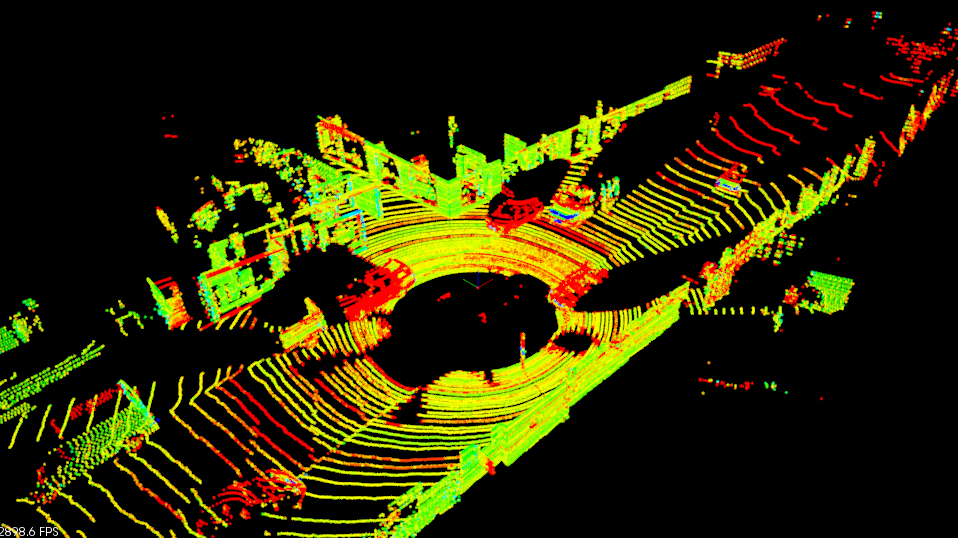
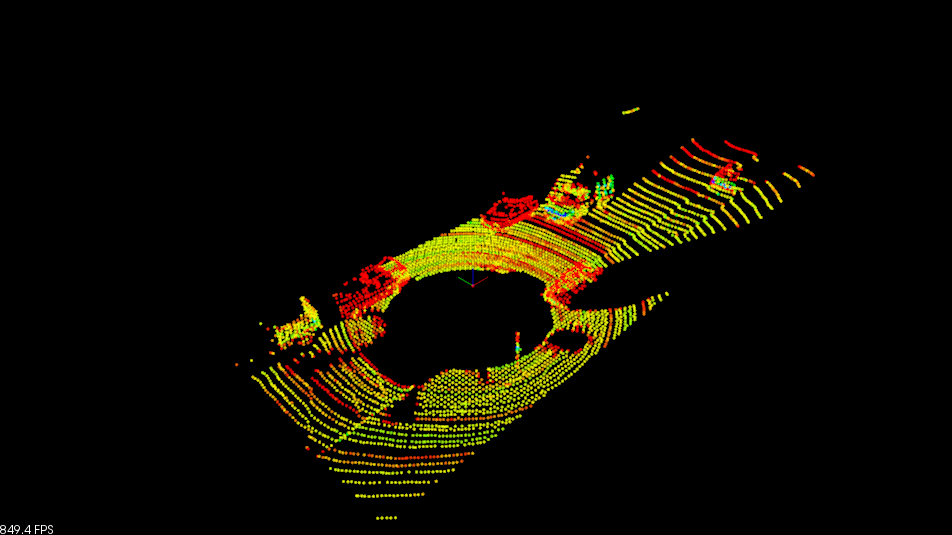
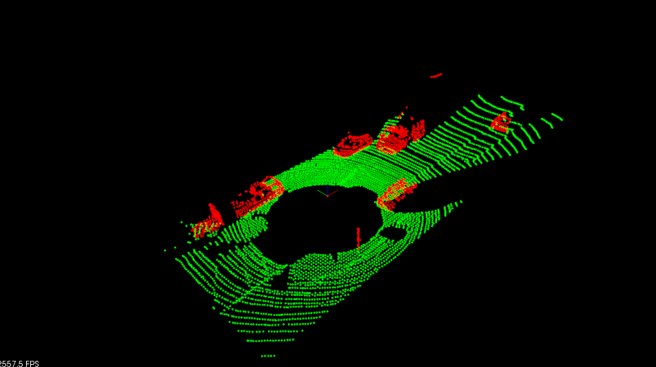
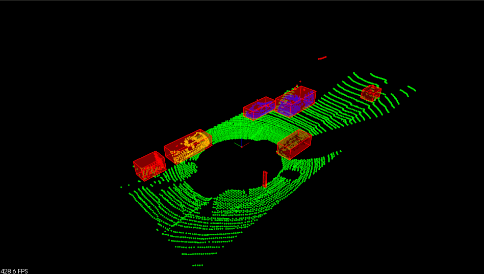

# Lidar Obstable Detection Project

Course project for Udacity Sensor Fusion Engineer Nanodegree Program

## Overview

This project implements a basic pipeline to detect obstables using lidar data. The pipeline consists of below stage.

1. Filtering
2. plane segmentation
3. obstacle clustering

All the key algorithms used in the pipeline like RANSAC plane segmentation, three dimension KD tree, and Euclidean Clutering are implemented with C++, as opposed to the ready API provided in PCl library in the attempt to gain deeper understanding about these algorithms. 

## Final Result
The pipleine is applied to a recorded lidar data stream, and reasonably good result are obtained as below.

Raw lidar point cloud

Obstable detection result

## Implementation Details

### Raw Lidar Data

### Fitlering

Two filtering operation are done:  
1) Use VoxelGrid to reduce the resolution of lidar point cloud  
2) Use Region of interest to fitler out areas that are far away from the ego car, as well as the roof area  

### Plane Segmentation

Used RANSAC to find ground plane

RANSAC is an effective approch to fit a modle out of data with many outliers. Basically it randomly generate a number of models, and then pick the one that fit the data best. In the case of use RANSAC to fit a plane out of lidar could point, below are the steps,

1) randomly sample three points, and fit a plane to them  
2) out of all remaining points, calcuate the inlier number for the fitted plane  
3) repeat 1) and 2)  
4) pick the plane that has maximum number of inliers  

The plane segmentation takes about 122 ms per frame, while the one implemented in PCL libary API takes about 1 ms. The difference could come from differnt RANSAC approach. Another approach would be to randomly sample a percentage of the points, like 20%, fit a plane to that, and then calcuate the fitting error of the plane. After certain number of iterations, pick the model with least error. This approach avoid transversing every single points while calculating the consensus of the model, and is expected to faster. 

### Obstacle detection

Use three dimensional KD tree to store all the obstacle points, and then perform euclidean clutering on the tree.

### KD Tree

KD Tree can help speed up the process of finding nearest neighbour. Its implementation involves two major components, create the tree and search via the tree.

### Euclidean Clutering

Intuively speaking, Euclidean clustering cluster points as one group if their euclidean distance is within a specific range d. below are the steps,  

1) start with a point, pick all of  neighbours B within distance d    
2) iterate on all of the points in B  
3) gourp the points obtained in 1) and 2) as a cluster, remvoe them from the points set, and continue to cluster remaining points.  

The clustering takes about 50 ms, while the one implemented in PCL takes about 3 ms. This might be improved by creating balanced kd tree.

## Reflections

As an extension of this coure project, two featrues can be added in the future. First, add tracking feature and leverage detection result from previous frames to improve detection stability, and add ROS interface so that the pipeline can work on a lidar device in real time.
